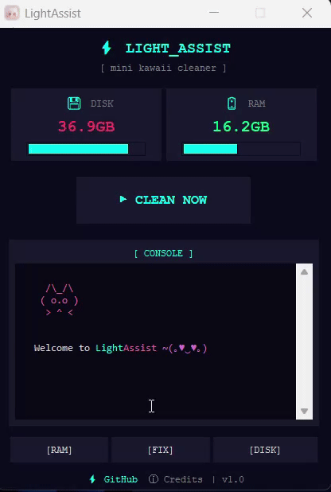

<div align="center">


# LightAssist

### Minimal • Lightweight • Kawaii Windows Cleaner

<p>
  
  
  
  
</p>

<p>
  
  
  
</p>

**🌐 Language:** [🇮🇩 Indonesia](README.md) • [🇺🇸 English](#)


**Clean your PC with one click • Safe • Fast • Cute**

<p>
  <a href="https://github.com/MiminCat/lightassist/releases">
    
  </a>
  <a href="https://github.com/MiminCat/lightassist/releases">
    
  </a>
</p>

</div>

---

## 📋 Table of Contents

- [About](#-about-lightassist)
- [Features](#-key-features)
- [Interface](#-interface)
- [Installation](#-installation)
- [How to Use](#-how-to-use)
- [Security & Privacy](#️-security--privacy)
- [Technology](#-technology)
- [Build from Source](#️-build-from-source)
- [Contributing](#-contributing)
- [Roadmap](#-roadmap)
- [License](#-license)
- [Credits & Appreciation](#-credits--appreciation)

---

## 🌸 About LightAssist

LightAssist is a Windows system cleaner application designed for **simplicity** and **efficiency**. No complicated settings or annoying background processes—just one click to clean your PC.

### Why LightAssist?

| Feature | LightAssist | Other Cleaners |
|---------|-------------|----------------|
| **RAM Usage** | <50MB | 100-500MB |
| **Size** | ~10MB | 50-200MB |
| **Startup Impact** | None | Often runs at startup |
| **Ads/Bloat** | Zero | Common |
| **Open Source** | ✅ | Usually ❌ |

---

## ✨ Key Features

<table>
<tr>
<td width="50%">

#### 🧹 One-Click Cleaning
- Remove Windows temporary files
- Empty Recycle Bin
- Optimize RAM usage
- Fast process (<30 seconds)

#### 🐱 Cute Console
- Real-time cleaning logs
- ASCII art animations
- Detailed file information
- Color-coded messages

</td>
<td width="50%">

#### 📊 System Monitoring
- Real-time Disk C: monitoring
- RAM usage tracking
- Color-based alerts
- Automatic updates

#### 🛠️ Additional Tools
- **[RAM]** Fast RAM refresh
- **[FIX]** Hardware troubleshooting
- **[DISK]** Windows Disk Cleanup

</td>
</tr>
</table>

### What Gets Cleaned?

```
📁 %TEMP% (User Temporary Files)
📁 C:\Windows\Temp (System Temporary Files)
🗑️ Recycle Bin
💾 RAM Optimization (Safe method)
```

---

## 📸 Interface

<div align="center">



**Dark Cyber Theme • Real-time Monitoring • Cute Console**

</div>

### Interface Highlights

- ⚫ **Tema Gelap**: Estetika cyber modern
- 📊 **Statistik Langsung**: Monitoring disk & RAM dengan progress bar
- 🎨 **Konsol Berwarna**: Log dengan syntax highlighting
- 🐱 **Kucing ASCII**: Aksen kucing lucu di konsol aplikasi

---

## 📦 Installation

### Method 1: Installer (Recommended)

1. Download [**LightAssist-Setup.exe**](https://github.com/MiminCat/lightassist/releases)
2. Run the installer
3. Follow the installation wizard
4. Ready to use!

**Benefits:**
- ✅ Automatic shortcuts (Desktop, Start Menu)
- ✅ Uninstaller included
- ✅ Update notifications

### Method 2: Portable

1. Download [**LightAssist-portable.exe**](https://github.com/MiminCat/lightassist/releases)
2. Save to any folder
3. Double-click to run

**Benefits:**
- ✅ No installation needed
- ✅ Run from USB drive
- ✅ No traces left behind

### ⚠️ Windows SmartScreen Warning

If a warning appears when you first run it:

1. Click **"More info"**
2. Click **"Run anyway"**

**Why does this happen?**
- New apps don't have "reputation" with Microsoft yet
- No code signing certificate (expensive)
- **100% safe** - open source code for auditing

---

## 🚀 How to Use

### Quick Guide

```
1. Open LightAssist
2. Click the "CLEAN NOW" button
3. Wait for the process to complete (10-30 seconds)
4. Check results in the console log
5. Done! ✨
```

### Usage Tips

- 🔄 **Frequency**: Run once every 1-2 weeks
- 🎮 **Gaming**: Use [RAM] tool before playing
- 🔧 **Hardware Issues**: Use [FIX] for troubleshooting
- 💿 **Deep Cleaning**: Combine with [DISK] tool

---

## 🛡️ Security & Privacy

### What It Does ✅

- Remove temporary files (safe)
- Empty Recycle Bin
- Optimize RAM with Windows API
- Monitor system locally
- Display detailed logs

### What It Does NOT Do ❌

- Edit Windows Registry
- Delete personal files/documents
- Connect to internet (100% offline)
- Run background processes
- Install additional software
- Tracking or telemetry

### Open Source

All code is available for audit:
```bash
git clone https://github.com/MiminCat/lightassist.git
# Review the code anytime
```

---

## 🧰 Technology

<div align="center">


</div>

| Technology | Purpose |
|-----------|----------|
| **Python 3.8+** | Core application |
| **Tkinter** | Native GUI framework |
| **psutil** | System monitoring |
| **PyInstaller** | Executable packaging |
| **Custom Theme** | Cute cyber aesthetic |

### Requirements

```
python>=3.8
tkinter (included in Python)
psutil>=5.9.0
```

---

## 🏗️ Build from Source

### Prerequisites

- Python 3.8 or newer
- pip package manager
- Git
- (Optional) Inno Setup for building Windows installer

---

### Steps

```bash
# 1. Clone the repository
git clone https://github.com/MiminCat/lightassist.git
cd lightassist

# 2. Install dependencies
python -m pip install -r requirements.txt

# 3. Run in development mode
python main.py

# 4. Build executable (portable)
# Make sure pyinstaller is installed
pip install pyinstaller
pyinstaller --onefile --windowed --icon=assets/icon.ico --name=LightAssist lightassist.py

# 5. Executable will be in dist/ folder

### Build Installer (Windows)

```bash
# Memerlukan Inno Setup terinstall
iscc installer-script.iss
```

---

## 🤝 Contributing

Contributions are welcome! Here's how to contribute:

### How to Contribute

1. 🍴 Fork this repository
2. 🌱 Create a new branch (`git checkout -b feature/AmazingFeature`)
3. ✍️ Commit your changes (`git commit -m 'Add some AmazingFeature'`)
4. 📤 Push to the branch (`git push origin feature/AmazingFeature`)
5. 🎉 Open a Pull Request

### Contribution Ideas

- 🐛 **Bug Reports**: Report bugs you find
- ✨ **Features**: Suggest new features
- 📝 **Documentation**: Improve or add documentation
- 🌐 **Translations**: Help translate to other languages
- 🎨 **UI/UX**: Suggest interface improvements
- 🐱 **More Cats**: Add ASCII art cats!

### Code Style

- Follow PEP 8 guidelines
- Use type hints
- Comment complex code
- Test before committing

---

## 🌱 Roadmap

### Current Version (v1.0)
- [x] One-click cleaning
- [x] System monitoring
- [x] Cute console
- [x] Dark cyber theme
- [x] Additional tools (RAM, FIX, DISK)

### Planned Features
- [ ] Light theme option
- [ ] Scheduled automatic cleaning
- [ ] Multi-language support
- [ ] Detailed cleaning reports
- [ ] Custom cleaning profiles
- [ ] Plugin system
- [ ] Startup optimization
- [ ] More ASCII animations

See [Issues](https://github.com/MiminCat/lightassist/issues) for future feature discussions.

---

## 📜 License

LightAssist is licensed under the [MIT License](LICENSE).

```
MIT License

Copyright (c) 2025 MiminCat

Permission is hereby granted, free of charge, to any person obtaining a copy
of this software and associated documentation files (the "Software"), to deal
in the Software without restriction, including without limitation the rights
to use, copy, modify, merge, publish, distribute, sublicense, and/or sell
copies of the Software, and to permit persons to whom the Software is
furnished to do so, subject to the following conditions:

The above copyright notice and this permission notice shall be included in all
copies or substantial portions of the Software.
```

**TL;DR**: Free to use for anything, commercial or personal.

---

## 💖 Credits & Appreciation

### Created By

**MiminCat** - [GitHub](https://github.com/MiminCat)

### Special Thanks To

- 🤖 **ChatGPT & Claude AI** - Development assistance
- ☕ **Coffee** - Coding fuel
- 🎵 **Lofi Music** - Coding atmosphere
- 🐱 **Cats** - Inspiration & fun
- ⭐ **GitHub Community** - Support & feedback

---

<div align="center">

### 🌟 Star History

[](https://star-history.com/#MiminCat/lightassist&Date)

---

### 📬 Support

<p>
  <a href="https://github.com/MiminCat/lightassist/issues">
    
  </a>
  <a href="https://github.com/MiminCat/lightassist/discussions">
    
  </a>
</p>

**Found it helpful? Give it a star ⭐!**

---

**Made with 💖 by [MiminCat](https://github.com/MiminCat) • © 2025 • Keep your PC clean & cute!** 🐱

</div>
